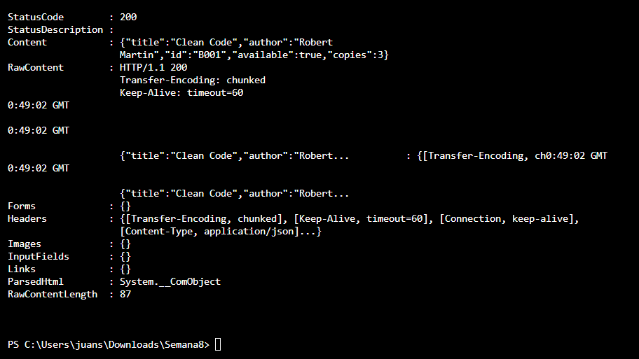
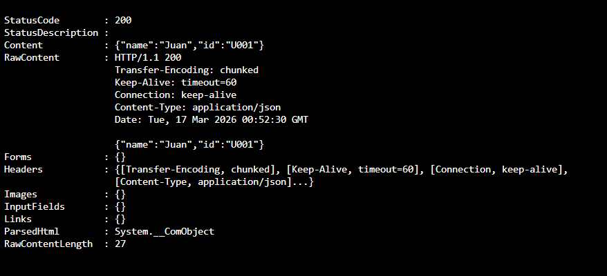
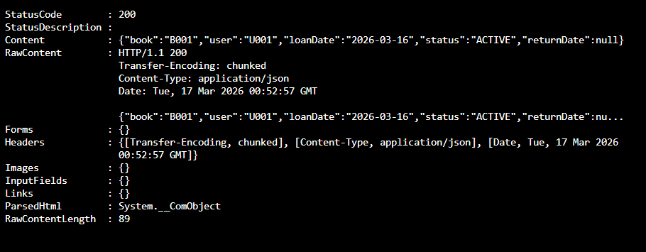
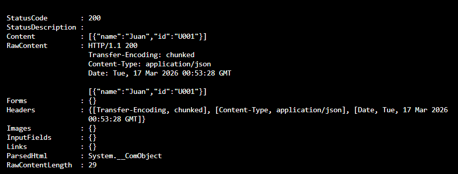
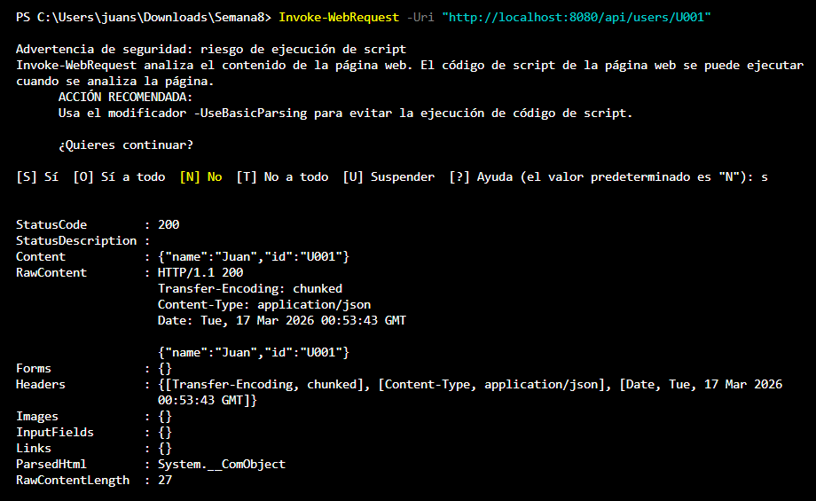

# DOSW-Library

Sistema de gestión de biblioteca que permite administrar libros, usuarios y préstamos.

---

## Ejecución de la API

### Agregar libro

### Obtener todos los libros

### Obtener libro por ID

### Actualizar disponibilidad de un libro

### Registrar usuario y préstamo

---

## Pruebas de los servicios

Ejecución de 21 pruebas unitarias sobre `BookService`, `UserService` y `LoanService` con resultado exitoso.

---

## Cobertura de código - JaCoCo

Reporte de cobertura generado con JaCoCo. Los servicios de negocio alcanzan el 100% de cobertura.

--- 

## Diagrama de clases
 

## Diagrama de especificos
 

## Diagrama de componentes general
 