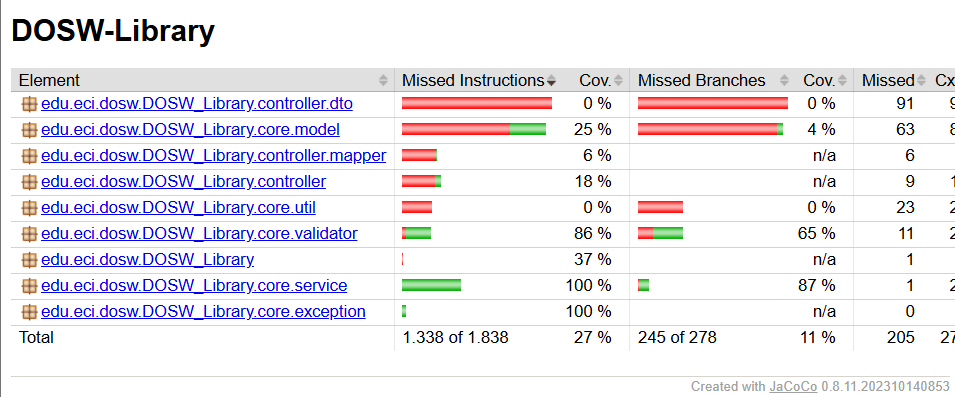
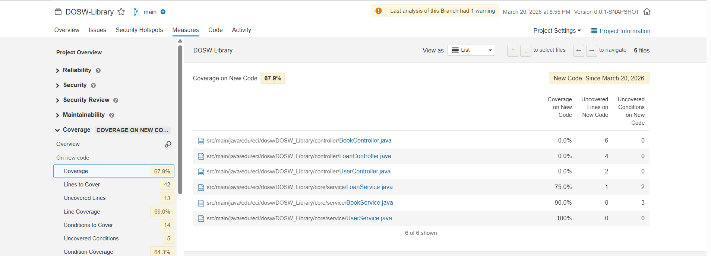
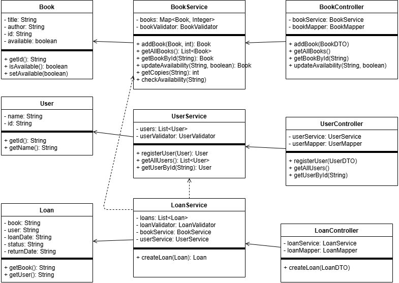
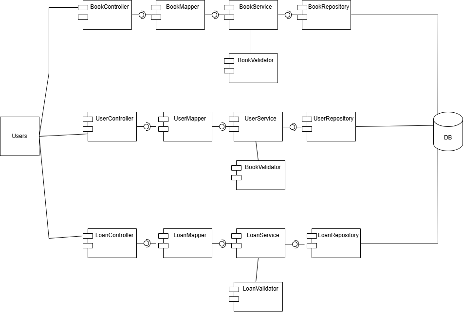
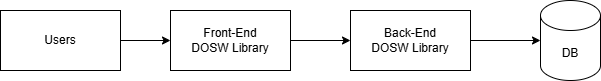
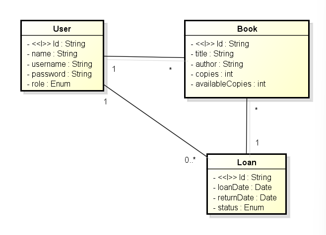
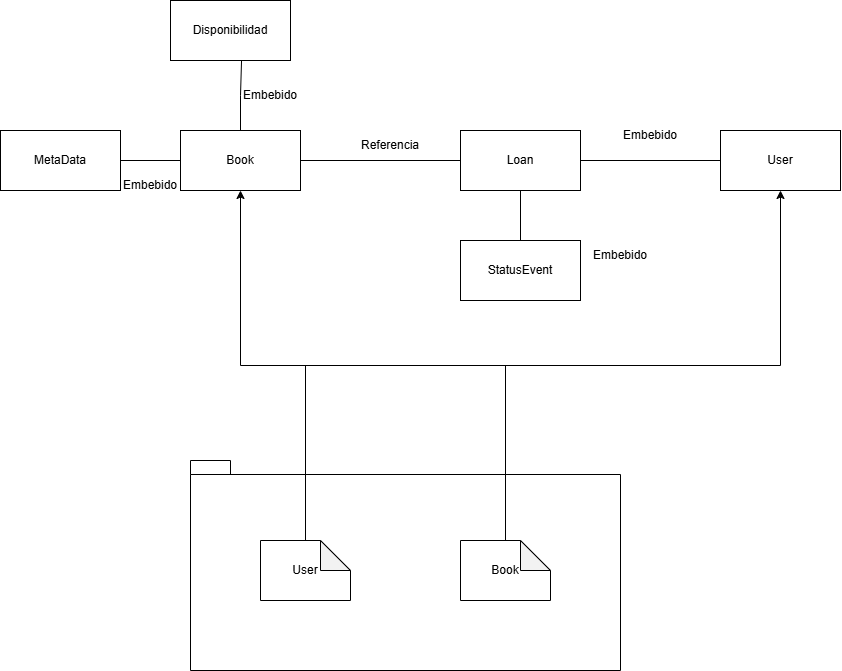

# DOSW-Library

Sistema de gestión de biblioteca desarrollado con Spring Boot. Permite administrar libros, usuarios y préstamos. Cada usuario puede tener máximo un préstamo activo a la vez, y el sistema verifica automáticamente la disponibilidad del libro antes de realizar el préstamo.

---

## Índice

- [Pruebas de los servicios](#pruebas-de-los-servicios)
- [Cobertura de código - JaCoCo](#cobertura-de-código---jacoco)
- [Análisis estático - SonarQube](#análisis-estático---sonarqube)
- [Diagrama de clases](#diagrama-de-clases)
- [Diagrama de específicos](#diagrama-de-específicos)
- [Diagrama de componentes general](#diagrama-de-componentes-general)
- [Diagrama modelo de entidad relación](#diagrama-modelo-de-entidad-relación)
- [Video de las pruebas API](#video-de-las-pruebas-api)
- [Pruebas de seguridad Swagger](#pruebas-de-seguridad-swagger)

---

## Pruebas de los servicios

Se implementaron pruebas unitarias y funcionales sobre los tres servicios principales. Todas pasan sin errores las 31 pruebas hechas.

---

## Cobertura de código - JaCoCo

Los servicios de negocio alcanzan un 97% de cobertura y los validadores un 86%. El porcentaje total se ve afectado por clases de datos como DTOs y mappers que no contienen lógica.

---

## Análisis estático - SonarQube

El análisis arrojó 0 bugs, 0 vulnerabilidades y 0 security hotspots. Los code smells encontrados son menores y están relacionados principalmente con convenciones de estilo.

---

## Diagrama de clases

El diagrama está organizado en tres capas principales. La primera son los modelos, que representan las entidades del sistema: `Book` con título, autor, ID y disponibilidad; `User` con nombre e ID; y `Loan` que conecta un libro con un usuario guardando la fecha y estado del préstamo.

La segunda capa son los servicios, donde vive toda la lógica de negocio. `LoanService` depende de `BookService` y `UserService` porque al crear un préstamo necesita verificar que el usuario existe y que el libro está disponible.

La tercera capa son los controllers, que reciben las peticiones HTTP y las delegan a sus servicios. Cada controller usa un mapper para convertir entre DTOs y modelos.

## Diagrama de específicos

Aquí veremos a nivel interno el manejo de la estructura del código, con los controladores para los componentes importantes de libros, usuarios y préstamos, con sus mappers que serán los que internamente harán las transformaciones necesarias para que el servicio maneje sus validadores y en un futuro el repositorio se encargará de persistir la información en la base de datos.

## Diagrama de componentes general

Aqui en general se coloco lo general del comportamiento de Dosw-Library, con el usuario que entra al front y como tal el back o el core de la api es la que guardara esas solicitudes o operaciones CRUD para que se guarde en una base de datos.

## Diagrama modelo de entidad relación

En el diagrama podemos visualizar las 3 tablas claves que seran las de libros, usuarios y prestamos con sus respectivos atributos para que en la API en formato JSON se guarde de manera adecuada

---

## Diagrama modelo no relacional - MongoDB

El modelo no relacional representa la estructura de los documentos almacenados en MongoDB. A diferencia del modelo relacional, los datos se organizan en colecciones de documentos JSON, lo que permite mayor flexibilidad en la estructura de la información.

---

## Video de las pruebas API

[Link del video de las pruebas API de la funcionalidades](https://youtu.be/EQ_w8G26Qlo)

---

## Pruebas de seguridad Swagger

[Video de las pruebas de seguridad con Swagger](https://youtu.be/P3C_w7uBhU4)
